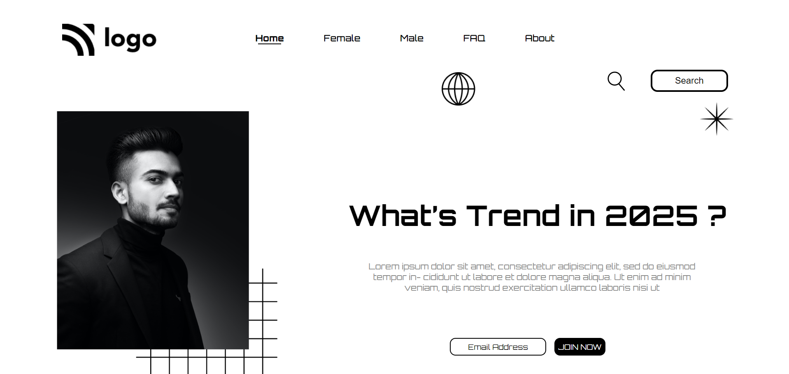

# Portfolio Project

## Description

A Static Portfolio Web page Created using `HTML` and `CSS`.

This project is Hosted on `Netlify`

**Created By :** Yogesh Yadav

## Learing from this Project

- Creating a Navingation Bar
- Positioning of the Element
- Positioning of Image in Web page
- How to Create `Readme.md` file

__Project Snap Shot__

> Please find the Link of the Project Below
### 
